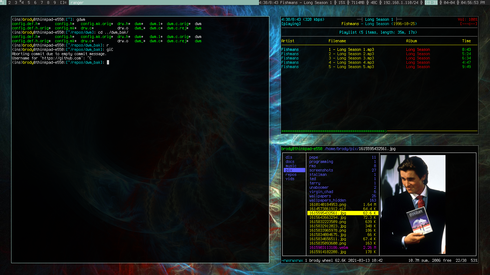

# rethyxyz-dwm
My build of dwm. Minimally patched. Contains altbar, transparency, fullscreen, statuscolors, and gaps patches. Supports XF86 keys.

  

## Keybindings
- **F1** / **Super + Shift + f**: Toggle fullscreen
- **F4** / **Super + Shift + Return**: Select last frame/window as master window/frame
- **F6** / **Super + Shift + q**: Kill selected frame/window
- **Super + 0**: View all tags
- **Super + 1-9**: Go to workspace/tag 1 - 9
- **Super + Ctrl + h**: Resize tag -1
- **Super + Ctrl + l**: Resize tag +1
- **Super + Ctrl + m**: Spawn USB mounting script
- **Super + Ctrl + t**: Spawn title case script
- **Super + Equal**: Increment gaps +1
- **Super + F1** / **XF86AudioMute**: Volume mute
- **Super + F10** / **XF86AudioPrev**: Mpc previous song
- **Super + F11** / **XF86AudioPlay**: Mpc toggle pause/play song
- **Super + F12** / **XF86AudioNext**: Mpc next song
- **Super + F2** / **XF86AudioLowerDown**: Volume down
- **Super + F3** / **XF86AudioRaiseUp**: Volume up
- **Super + F5** / **XF86MonBrightnessDown**: Brightness down
- **Super + F6** / **XF86MonBrightnessUp**: Brightness up
- **Super + F9** / **XF86AudioStop** / **Super + n**: Spawn Ncmpcpp (NCurses Music Player Plus Plus)
- **Super + Minus**: Increment gaps -1
- **Super + Return** Spawn simple terminal (st)
- **Super + Shift + 1-9**: Move primary frame/window to workspace/tag 1 - 9
- **Super + Shift + b**: Toggle status bar
- **Super + Shift + c**: Kill dwm (logout)
- **Super + Shift + equal**: Set gaps to 0
- **Super + Shift + h**: Move selected frame/window to monitor -1
- **Super + Shift + l**: Move selected frame/window to monitor +1
- **Super + Shift + m**: Spawn mutt
- **Super + Shift + n**: Spawn newsboat
- **Super + Shift + p**: Spawn picard
- **Super + Shift + r**: Execute random wallpaper script
- **Super + Shift + s**: Spawn scratchpad
- **Super + Shift + t**: Spawn TODO file in vim
- **Super + Tab**: Goto previous workspace/tag
- **Super + b**: Spawn qutebrowser
- **Super + comma**: Mpc seek backward
- **Super + d**: Increment master -1
- **Super + f**: Set layout floating
- **Super + h**: Goto monitor -1 (left)
- **Super + i**: Increment master +1
- **Super + j**: Focus stack +1
- **Super + k**: Focus stack -1
- **Super + l**: Goto monitor +1 (left)
- **Super + m**: Set layout monocle
- **Super + p**: Spawn dmenu
- **Super + period**: Mpc seek forward
- **Super + r**: Spawn ranger
- **Super + s**: Spawn soulseek
- **Super + space**: Toggle float/tiling layout
- **Super + t**: Set layout tiling

See `config.h` for other keybindings not included here.
